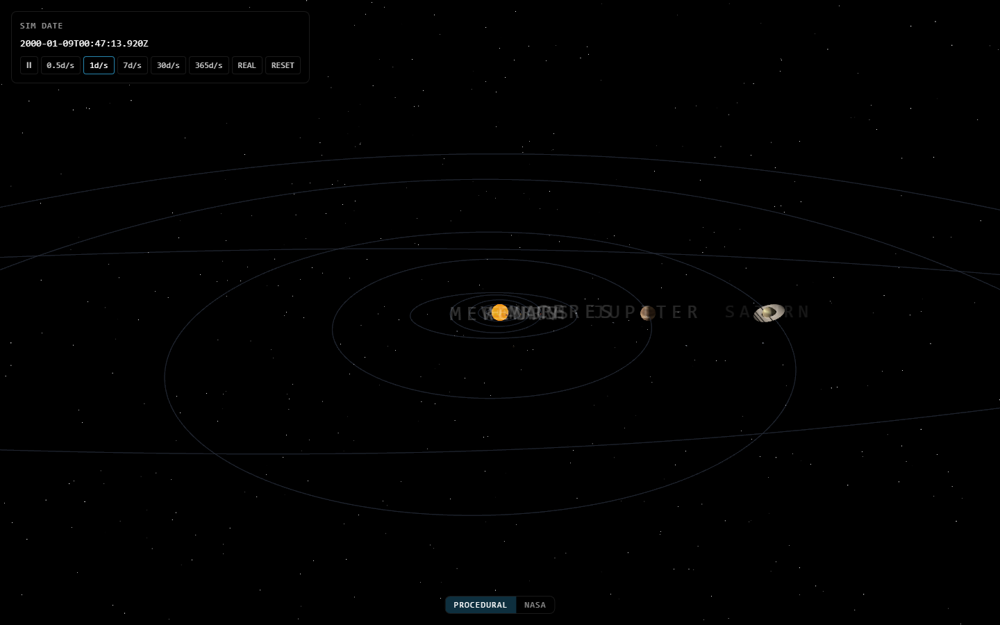

# Solar — interactive 3D solar system

A real-time 3D solar system built with React Three Fiber, running JPL-derived orbital mechanics in the browser.



## Features

- Real JPL orbital data (Kepler elements, J2000 epoch) for the Sun, 8 planets, Ceres, Pluto, Eris — plus 9 moons
- Time controls: pause, 0.5×–365× speed, jump to real time, reset to J2000
- Procedural canvas textures by default; toggle NASA photo textures (2K, solarsystemscope.com)
- Click any body to focus it; orbit lines, asteroid belt, Bloom post-processing
- 34 unit tests on the pure orbital math; zero WebGL in tests (jsdom can't run it)

## Quickstart

Requires [Bun](https://bun.sh) 1.3+.

```sh
cd client
bun install
bun run dev      # http://localhost:5173
```

`bun run verify` runs the full gate: lint + typecheck + tests.

## Project layout

```
client/          React 19 + Vite SPA (TypeScript strict)
  src/solar/bodies/jpl.ts         JPL orbital data (AU, km, days)
  src/solar/bodies/display.ts     km→scene-unit scaling + visibility floors
  src/solar/simulation/orbitMath.ts  Kepler solver + J2000 time
  src/solar/simulation/           Zustand time/UI stores (read via getState() in useFrame)
  src/solar/textures/             procedural canvas textures + NASA photo mode
  src/solar/scene/                Sun, planets, moons, orbit lines, asteroid belt
  src/solar/hud/                  time controls, info panel, texture toggle
```

A `server/` (Express 5 + Mongoose API) is planned next.

## Live demo

Deployed to GitHub Pages from the `main` branch: <https://suvodeep12.github.io/Solar/>

## License

MIT — see [LICENSE](LICENSE).
